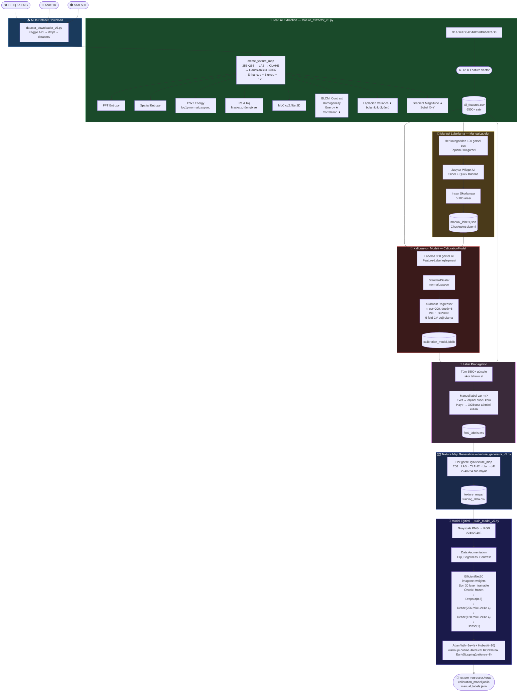
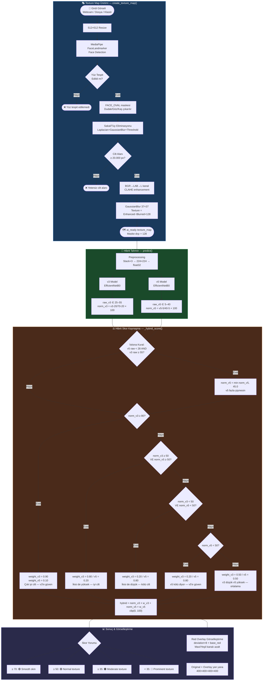
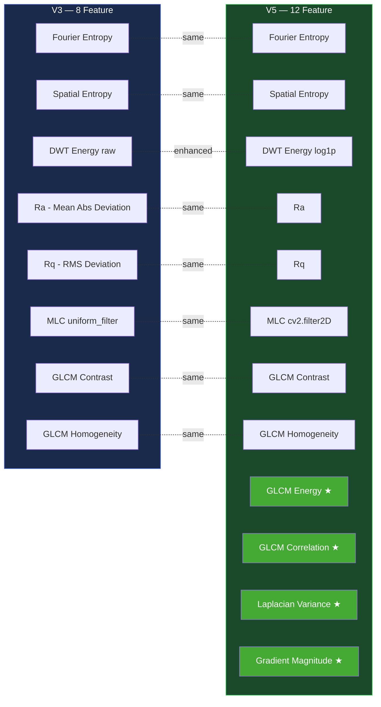

# 🔬 Texture Analysis Notebook — Ayrıntılı Analiz & Pipeline Dokümantasyonu

> **Kapsam:** `Texture_Analysis_Colab_v3.ipynb` ve `Texture_Analysis_Colab_v5.ipynb` + `local_tester.py` (Hibrit Çalışma Zamanı)  
> **Tarih:** Mart 2026 · **Platform:** Google Colab (GPU: T4) · **Framework:** TensorFlow / Keras

---

## 📋 İçindekiler

1. [Genel Bakış ve Versiyon Karşılaştırması](#1-genel-bakış-ve-versiyon-karşılaştırması)
2. [V3 Pipeline — Detaylı Analiz](#2-v3-pipeline--detaylı-analiz)
3. [V5 Pipeline — Detaylı Analiz](#3-v5-pipeline--detaylı-analiz)
4. [Mimari Pipeline Diyagramları](#4-mimari-pipeline-diyagramları)
5. [Feature Extraction — Derinlemesine İnceleme](#5-feature-extraction--derinlemesine-i̇nceleme)
6. [Hibrit Model — Çalışma Zamanı Kaynaşma Mantığı](#6-hibrit-model--çalışma-zamanı-kaynaşma-mantığı)
7. [Model Mimarileri Karşılaştırması](#7-model-mimarileri-karşılaştırması)
8. [Dosya Çıktıları](#8-dosya-çıktıları)
9. [Veri Akışı Özetleri](#9-veri-akışı-özetleri)

---

## 1. Genel Bakış ve Versiyon Karşılaştırması

### Temel Felsefe Farkı

| Kriter | V3 | V5 |
|---|---|---|
| **Label Stratejisi** | Tamamen otomatik (PCA tabanlı unsupervised) | Yarı-denetimli (insan kalibrasyonu + XGBoost propagasyonu) |
| **Veri Seti** | Sadece FFHQ (normal yüzler) | FFHQ + Acne + Scar (çeşitlendirilmiş) |
| **Veri Seti Boyutu** | 10.000 görsel | 6.500 görsel (5K FFHQ + 1K Acne + 500 Scar) |
| **Kalibrasyon** | PCA →  Sigmoid normalizasyonu | Manuel 300 label → XGBoost → 6,500+ yayılım |
| **Label Kalitesi** | Matematiksel, insan tercihi içermez | İnsan yargısı + matematiksel özellik karışımı |
| **Güçlü Olduğu Alan** | İyi ciltler (pürüzsüz, temiz) | Sorunlu ciltler (sivilce, skar, ciddi doku bozukluğu) |
| **Hedef MAE** | 5–8 | Belirlenmemiş (CV tabanlı değerlendirme) |
| **Model Çıktı Aralığı (tipik)** | 25–55 (dar, pasif) | 5–40 (geniş, agresif alt pushlama) |
| **Tekstür Haritası Kaynağı** | MediaPipe yüz maskesi ile face-only | Direkt tüm görsel (masksiz) |
| **Training Dengesi** | Oversampling (10 bin → \~12–15K balanced) | Stratejisiz (ham dağılım kullanılır) |
| **GLCM Parametreleri** | distances=[1,3], angles=3, levels=64 | distances=[1,2], angles=3, levels=64 + energy + correlation |

---

## 2. V3 Pipeline — Detaylı Analiz

### 2.1 Hücre Bazında İşlem Akışı

#### **Cell 1 — GPU Kontrolü**
```python
!nvidia-smi
import tensorflow as tf
print(f"TensorFlow: {tf.__version__}")
print(f"GPU: {tf.config.list_physical_devices('GPU')}")
```
- Colab T4 GPU varlığını doğrular.
- TensorFlow sürümü loglanır.

---

#### **Cell 2 — Bağımlılık Kurulumu & Kaggle API**
```python
!pip install -q mediapipe PyWavelets scikit-image kaggle
```
Kurulum yapılan kütüphaneler ve rolleri:

| Kütüphane | Rol |
|---|---|
| `mediapipe` | Face Landmarker modeli (yüz maskesi üretimi) |
| `PyWavelets (pywt)` | Discrete Wavelet Transform (DWT) enerji hesabı |
| `scikit-image` | GLCM (Gray-Level Co-occurrence Matrix) özellikleri |
| `kaggle` | FFHQ veri seti indirme API'si |

Kaggle kimlik bilgileri `/root/.kaggle/kaggle.json` içine yazılır ve `chmod 600` ile güvence altına alınır.

---

#### **Cell 3 — FFHQ Veri Seti İndirme**
- `greatgamedota/ffhq-face-data-set` Kaggle dataseti indirilir.
- 10.000 PNG görsel rastgele seçilerek `raw_ffhq/` klasörüne kopyalanır.
- İndirme klasörü (`/content/ffhq_download`) temizlenir.
- **Boyut:** 256×256 piksel FFHQ yüz görselleri

---

#### **Cell 4 — `feature_extractor_v3.py` Yaratılması (%%writefile)**

`TextureFeatureExtractor` sınıfı 8 özellik üretir:

| Metot | Çıktı | Açıklama |
|---|---|---|
| `compute_entropy()` | `fourier_entropy` | 2D FFT → magnitude → Shannon entropisi |
| `compute_spatial_entropy()` | `spatial_entropy` | Gri-ton histogram → Shannon entropisi |
| `compute_dwt_energy()` | `dwt_energy` | Sym4 wavelet, 3 seviye, detail koefisyen enerjisi / piksel |
| `compute_roughness()` | `Ra`, `Rq` | Ortalama mutlak sapma ve RMS sapması (maske destekli) |
| `compute_mlc()` | `mlc` | 15×15 pencere → local std ortalaması (Mean Local Contrast) |
| `compute_glcm_features()` | `glcm_contrast`, `glcm_homogeneity` | 128×128 resize → 64-level → distances=[1,3] → 3 açı |

**`extract_feature_vector(texture_map, mask)`** → 8 boyutlu `np.array`

---

#### **Cell 5 — `label_generator_v3.py` Yaratılması (%%writefile)**

`LabelGenerator` sınıfı — PCA tabanlı otomatik etiketleme:

```
Adım 1: RobustScaler ile 8-d feature matrisini normalize et
Adım 2: PCA(n_components=1) → tek bir "degradasyon skoru"
Adım 3: Skorları percentile 2–98 arasına klip et (aykırı değer temizliği)
Adım 4: Sigmoid-benzeri stretching formülü:
    normalized = (x - min) / (max - min)
    stretched = 1 / (1 + exp(-5 * (normalized - 0.5)))
    score = (1 - stretched) * 100   ← inversiyon! yüksek degradasyon = düşük skor
```

**Formülün Önemi:** Sigmoid'in `(normalized - 0.5)` ortalanması, orta değerlerin lineer bir aralıkta kalmasını sağlar. `(1 - stretched)` ters çevirme ile "yüksek degradasyon → düşük pürüzsüzlük skoru" semantiği elde edilir.

Kayıt: `training_data/pca_scaler.joblib` (scaler + pca + score_min + score_max)

---

#### **Cell 6 — `dataset_generator_v3.py` Yaratılması (%%writefile)**

`DatasetGenerator` sınıfının `process_image()` metodu — **ayrıntılı adımlar:**

```
1. Görseli 512×512'ye yeniden boyutlandır
2. BGR → RGB dönüşümü
3. MediaPipe FaceLandmarker ile 478 landmark noktası tespiti
4. FACE_OVAL (34 nokta) ile yüz maskesi çiz → 255
5. LİPS + SOL_GÖZ + SAĞ_GÖZ + SOL_KAŞI + SAĞ_KAŞI bölgelerini çıkar → 0
         (lip: 20pt, sol/sağ göz: 16pt each, kaşlar: 10pt each)
6. Sakal/tüy eliminasyonu:
   - Laplacian kenar haritası al
   - GaussianBlur(25,25) ile yumşat (kıl sınırlarını genişlet)
   - Threshold(25) → beard_mask
   - face_mask AND NOT beard_mask → temiz cilt maskesi
7. Piksel sayısı kontrolü: < 20.000 piksel → atla (yetersiz cilt)
8. BGR → LAB renk uzayına çevir
9. L kanalını CLAHE (clipLimit=2.0, tileGridSize=8×8) ile iyileştir
10. GaussianBlur(37,37) ile düşük frekans arka planı çıkar
11. Texture Map = enhanced_L - blurred + 128   ← yüksek frekanslı doku
12. Maske dışı pikselleri 128 (nötr gri) yap
```

**Çıktı:** `(texture_map: np.uint8[512,512], mask: np.uint8[512,512])`

`generate_dataset()` — tüm veri seti üretim döngüsü:
1. Her görsel için `process_image()` çağır
2. Texture map'i `training_data/images/` klasörüne kaydet
3. `TextureFeatureExtractor.extract_feature_vector()` ile 8-d özellik çıkar
4. Tüm özellikler birikirken dosya isimlerini takip et
5. `LabelGenerator.fit()` → PCA + Sigmoid → roughness_score [0,100]
6. `training_data/labels.csv` ve `training_data/features.csv` kaydet

---

#### **Cell 7 — `train_model_v3.py` Yaratılması (%%writefile)**

**Oversampling Fonksiyonu `oversample_dataframe()`:**
- 10 eşit aralık (0-10, 10-20, ..., 90-100)
- Her aralık hedefi: 1.200 örnek
- Az örneklenen aralıklar tekrar edilir (`pd.concat * n_repeats`)
- Çok örneklenen aralıklar max 2.400'e kısılır

**Data Augmentation (TF Sequential):**
```
RandomFlip("horizontal")       ← sol-sağ yansıma
RandomRotation(0.03)           ← ±10.8° döndürme
RandomZoom(0.08)               ← ±8% yakınlaştırma
RandomContrast(0.1)            ← kontrast varyasyonu
```

**Model Mimarisi (EfficientNetB0 + Custom Head):**
```
Input:       (224, 224, 3) float32
EfficientNetB0: imagenet weights, training=True (tam fine-tune)
GlobalAveragePooling2D
Dense(256, relu)
BatchNormalization
Dropout(0.4)
Dense(128, relu)
BatchNormalization
Dropout(0.3)
Dense(64, relu)
Dense(1, linear, dtype=float32)    ← regresyon çıktısı
```

**Eğitim Hiperparametreleri:**

| Parametre | Değer |
|---|---|
| Optimizer | AdamW (lr=1e-3, weight_decay=1e-5) |
| Loss | Huber(delta=10.0) — outlier'lara dirençli |
| Metrik | MAE |
| Batch Size | 64 |
| Epochs | 40 |
| LR Schedule | 3-epoch linear warmup + cosine annealing |
| Early Stopping | patience=10, monitör=val_mae |
| Mixed Precision | float16 |

**LR Schedule Formülü:**
```python
if epoch < 3:
    lr = 1e-3 * (epoch + 1) / 3      # Linear warmup
else:
    lr = 1e-3 * 0.5 * (1 + cos(π * (epoch-3) / (40-3)))  # Cosine decay
```

---

#### **Cell 8 — Dataset Generation Koşulması**
- `training_data/labels.csv` yoksa `DatasetGenerator` çalıştırılır
- Score dağılım histogramı ve box plot gösterilir

---

#### **Cell 9 — Model Eğitimi**
```python
model, history = train(batch_size=64, epochs=40)
```

---

#### **Cell 10 — Eğitim Grafikleri**
- MAE eğrisi (train vs val)
- Huber Loss eğrisi (train vs val)

---

#### **Cell 11 — Skor Aralığı Bazlı Doğrulama**
5 aralıkta (0-20, 20-40, 40-60, 60-80, 80-100) rastgele 10 örnekle MAE hesaplanır. 
Model tahminleri `np.clip(pred, 0, 100)` ile sınırlandırılır.

---

#### **Cell 12 — Export**
```
export/
  texture_regressor.keras
  pca_scaler.joblib
  labels.csv
→ texture_model_v3.zip
```

---

#### **Cell 13 — Colab Upload ile Test**
- Kullanıcı fotoğraf yükler
- `DatasetGenerator.process_image()` ile texture_map üretilir
- Model tahmini yapılır
- Sonuç yorumu:
  - ≥70: "Pürüzsüz cilt"
  - ≥50: "Normal doku"
  - ≥35: "Orta duzey"
  - <35: "Belirgin doku"

---

## 3. V5 Pipeline — Detaylı Analiz

### 3.1 Konsept: Semi-Supervised Learning

V5'in temel yeniliği **insan kalibrasyonu** tabanlı label üretimidir. 300 görsel manuel olarak etiketlenir, bu etiketlerden bir XGBoost kalibrasyon modeli öğrenir, ardından bu model tüm 6.500+ görsele skor yayar.

### 3.2 Hücre Bazında İşlem Akışı

#### **Bölüm 1 — Setup & GPU Check**
V3 ile aynı yapıda, ek olarak `xgboost` ve `ipywidgets` kurulumu yapılır.

---

#### **Bölüm 2 — `dataset_downloader_v5.py` (%%writefile)**

3 farklı Kaggle dataseti indirilir:

| Dataset | Kaynak | Hedef Sayı | Klasör | Amaç |
|---|---|---|---|---|
| FFHQ | `greatgamedota/ffhq-face-data-set` | 5.000 PNG | `datasets/ffhq/` | Normal ciltler |
| Acne | `rutviklathiyateksun/acne-dataset-image-4620-images` | 1.000 | `datasets/acne/` | Sivilceli ciltler |
| Scar | `saranshbagri/scar` | 500 | `datasets/scar/` | Skar izleri |

Her dataset için:
1. Kaggle API ile `/tmp/` klasörüne indir + unzip
2. Rastgele örnekle ve hedef klasöre kopyala (sistemli isimlendirme: `ffhq_00001.png`)
3. `/tmp/` temizle

---

#### **Bölüm 3 — `feature_extractor_v5.py` (%%writefile)**

V5 feature çıkarımı V3'e göre **4 ek özellik** içerir:

| Özellik | V3 | V5 |
|---|---|---|
| `fft_entropy` | ✅ | ✅ |
| `spatial_entropy` | ✅ | ✅ |
| `dwt_energy` | ✅ (ham) | ✅ `log1p(enerji)` — log normalizasyonu |
| `ra`, `rq` | ✅ Maske destekli | ✅ Masksiz (tüm görsel) |
| `mlc` | ✅ `uniform_filter` | ✅ `cv2.filter2D` |
| `glcm_contrast` | ✅ | ✅ |
| `glcm_homogeneity` | ✅ | ✅ |
| `glcm_energy` | ❌ | ✅ **YENİ** |
| `glcm_correlation` | ❌ | ✅ **YENİ** |
| `laplacian_var` | ❌ | ✅ **YENİ** — bulanıklık tespiti |
| `gradient_mag` | ❌ | ✅ **YENİ** — Sobel gradient büyüklüğü |

**Texture Map Üretimi (V5 — `create_texture_map()`):**
```
1. 256×256 resize (V3: 512×512 ardından maske)
2. BGR → LAB
3. L kanalı → CLAHE(2.0, 8×8)
4. GaussianBlur(37,37)
5. texture = enhanced - blurred + 128
```
> **V3 ile Fark:** V5 MediaPipe yüz maskesi **kullanmaz** — tüm görsel doku haritası olarak işlenir.  
> Bu sayede acne/scar görsellerinde yüz tespiti başarısız olsa bile feature çıkarılabilir.

**Batch Feature Extraction:**
```python
features_list = extract_features_batch(paths)
df = pd.DataFrame(features_list)
df.to_csv('all_features.csv', index=False)
```

---

#### **Bölüm 4 — `manual_labeler.py` (%%writefile) — Manuel Etiketleme UI**

`ManualLabeler` sınıfı Jupyter widget tabanlı tam etiketleme arayüzü:

**Bileşenler:**
- `Output` widget — görsel gösterimi
- `IntSlider(0–100, step=5)` — hassas skor kontrolü  
- `BoundedIntText` — manuel sayı girişi
- `jslink` — slider ↔ text kutusu senkronizasyonu
- Hızlı skor butonları: [0, 20, 40, 60, 80, 100]
- "Kaydet & Sonraki" + "Atla" butonları
- İlerleme sayacı: `{done}/{total} (%)`
- Kategori bilgisi (FFHQ / ACNE / SCAR)

**Puanlama Rehberi (UI'de gösterilen):**
```
0–20   : Çok kötü (ciddi sivilce, derin skar, belirgin lezyon)
20–40  : Kötü (görünür sivilce/skar, düzensiz doku)
40–60  : Ortalama (hafif kusurlar, normal gözenek)
60–80  : İyi (temiz cilt, minimal kusur)
80–100 : Mükemmel (pürüzsüz, sağlıklı görünüm)
```

**Her kategoriden 100 görsel → toplam 300 manuel label**

**Checkpoint sistemi:**
- Her 10 labelde `manual_labels.json` kaydedilir
- Session yeniden başlatılırsa checkpoint'ten devam edilir
- Formatı: `{image_path: score, ...}`

---

#### **Bölüm 5 — `calibration_model.py` (%%writefile) — XGBoost Kalibrasyon**

`CalibrationModel` sınıfı:

**Eğitim Verisi Hazırlama:**
```python
def prepare_training_data(features_df, labels_dict):
    # Sadece manuel label olan satırları filtrele
    labeled_mask = features_df['image_path'].isin(labels_dict.keys())
    df_labeled = features_df[labeled_mask].copy()
    df_labeled['manual_score'] = df_labeled['image_path'].map(labels_dict)
    return df_labeled  # ~270–300 satır (atlanmış olanlar hariç)
```

**XGBoost Model Konfigürasyonu:**

| Parametre | Değer | Etki |
|---|---|---|
| `n_estimators` | 200 | Ağaç sayısı |
| `max_depth` | 6 | Ağaç derinliği |
| `learning_rate` | 0.1 | Öğrenme hızı |
| `subsample` | 0.8 | Satır örnekleme |
| `colsample_bytree` | 0.8 | Sütun örnekleme |

**Değerlendirme:**
- Train/Test split %80/20
- 5-fold Cross-Validation MAE
- Feature importance sıralaması (hangi özellik daha belirleyici?)

Kayıt: `calibration_model.joblib` (model + StandardScaler + feature_columns)

---

#### **Bölüm 6 — Label Propagation**

```python
# 1. Tüm görsellere kalibrasyon modeli ile skor tahmin et
df_features['predicted_score'] = calibrator.predict(df_features)

# 2. Manuel label olan görsellerde orijinal skoru koru (override)
def get_final_score(row):
    if row['image_path'] in manual_labels:
        return manual_labels[row['image_path']]  # İnsan skoru korunur
    return row['predicted_score']                # XGBoost tahmini

df_features['final_score'] = df_features.apply(get_final_score, axis=1)
```

**Sonuç:** Tüm 6.500+ görsele 0–100 arası final skor atanır.  
Skor dağılımı kategori bazlı histogramlarla görselleştirilir:
- FFHQ → yeşil (yüksek skor expected)
- Acne → kırmızı (düşük skor expected)
- Scar → turuncu (düşük-orta skor expected)

Kayıt: `final_labels.csv` (image_path, category, final_score)

---

#### **Bölüm 7 — `texture_generator_v5.py` (%%writefile) — Texture Map Üretimi**

`generate_texture_maps()` fonksiyonu:
```
Her görsel için:
  1. create_texture_map(image_path, output_size=224)
     - 256×256 resize → LAB → L kanalı → CLAHE → GaussianBlur → fark+128
     - 224×224'e son resize
  2. PNG olarak texture_maps/ klasörüne kaydet
  3. {texture_path, score} tuple'ını kayıt listesine ekle
```
Kayıt: `training_data.csv` (texture_path, score)

---

#### **Bölüm 8 — `train_model_v5.py` (%%writefile) — Ana Model Eğitimi**

**Veri Yükleme:**
```python
img = tf.image.decode_png(img, channels=1)   # Gri-ton PNG
img = tf.image.grayscale_to_rgb(img)          # 3 kanalı kopyala (EfficientNet uyumu)
```

**Model Mimarisi (EfficientNetB0 + Kısmi Dondurma):**
```
Input:        (224, 224, 3) float32
EfficientNetB0: imagenet weights
  └─ Son 30 katman: trainable=True
  └─ Önceki katmanlar: trainable=False (dondurulmuş)
GlobalAveragePooling2D (pooling='avg' parametresiyle)
Dropout(0.3)
Dense(256, relu, L2=1e-4)
Dropout(0.2)
Dense(128, relu, L2=1e-4)
Dense(1, dtype=float32)    ← regresyon çıktısı
```

> **V3 vs V5 Fark:** V5'te tüm EfficientNet katmanları değil, **sadece son 30 katman** eğitilir. Bu hem overfitting'i azaltır hem eğitimi hızlandırır. Ek olarak L2 regularization eklenir.

**Hiperparametreler:**

| Parametre | V3 | V5 |
|---|---|---|
| Initial LR | 1e-3 | 1e-4 (10× daha düşük) |
| Batch Size | 64 | 32 |
| Epochs | 40 | 40 |
| LR Schedule | warmup+cosine | warmup+cosine+ReduceLROnPlateau |
| Early Stopping | patience=10 | patience=8 |
| Loss | Huber(10) | Huber(10) |
| EfficientNet Fine-tune | Tam (training=True) | Kısmi (son 30 katman) |

**Ekstra Callback (V5'e özgü):**
```python
ReduceLROnPlateau(monitor='val_mae', factor=0.5, patience=4, min_lr=1e-6)
```

---

#### **Bölümler 9 & 10 — Test & Export**

**Detaylı Doğrulama** (4 aralıkta: 0-30, 30-50, 50-70, 70-100):
```python
for low, high in [(0,30), (30,50), (50,70), (70,100)]:
    mae = mean(abs(predictions[mask] - actuals[mask]))
```

**Export Dosyaları:**
```
texture_model_v5/
  texture_regressor.keras      ← ana model
  calibration_model.joblib     ← XGBoost kalibratör
  final_labels.csv             ← tüm label'lar
  manual_labels.json           ← orijinal insan etiketleri
→ texture_model_v5.zip
```

**V5 Test Fonksiyonu** (masksiz, basit):
```python
def predict_score(model, img_path):
    texture_map = create_texture_map_simple(img)
    input_img = np.stack([texture_map, texture_map, texture_map], axis=-1)
    pred = model.predict(input_img[np.newaxis], verbose=0)[0][0]
    return np.clip(pred, 0, 100)
```

---

## 4. Mimari Pipeline Diyagramları

### 4.1 V3 Eğitim Pipeline'ı

```mermaid
flowchart TD
    A([🖼️ FFHQ Raw Images\n10.000 PNG - 256×256]) --> B

    subgraph DATASET["📦 Dataset Generation — DatasetGenerator"]
        B[MediaPipe FaceLandmarker\n478 nokta tespiti] --> C
        C[Yüz Maskesi Oluştur\nFACE_OVAL → Dudak/Göz/Kaş çıkar] --> D
        D[Sakal/Tüy Eliminasyonu\nLaplacian + GaussianBlur + Threshold] --> E
        E{Piksel Sayısı\n≥ 20.000?}
        E -- Hayır --> SKIP([❌ Görseli atla])
        E -- Evet --> F
        F[BGR → LAB → L Kanalı\nCLAHE Enhancement] --> G
        G[GaussianBlur 37×37\nDüşük frekansı çıkar] --> H
        H[Texture Map\nEnhanced − Blurred + 128\nMaske dışı = 128] --> I
    end

    subgraph FEATURE["🔬 Feature Extraction — TextureFeatureExtractor"]
        I --> I1[Fourier Entropy\nFFT2 → magnitude → Shannon]
        I --> I2[Spatial Entropy\nHistogram → Shannon]
        I --> I3[DWT Energy\nsym4, 3-level → detail coeff²/px]
        I --> I4[Roughness Ra & Rq\nMask-aware mean abs/RMS dev]
        I --> I5[MLC\n15×15 window → local std mean]
        I --> I6[GLCM Contrast &\nHomogeneity\ndist=[1,3], 3 angles]
        I1 & I2 & I3 & I4 & I5 & I6 --> FV([📊 8-D Feature Vector])
    end

    subgraph LABEL["🏷️ Label Generation — LabelGenerator"]
        FV --> J[RobustScaler\nOutlier-resistant normalization]
        J --> K[PCA n_components=1\nMax variance yönü]
        K --> L[Percentile 2–98 Clipping\nAykırı değerleri temizle]
        L --> M["Sigmoid Stretching\nscore = 1 − σ(5·(x−0.5)) × 100\nInversiyon: yüksek degradasyon = düşük skor"]
        M --> N([📋 roughness_score ∈ 0–100])
    end

    subgraph BALANCE["⚖️ Data Balancing — oversample_dataframe"]
        N --> O[10 Skor Aralığına Böl\n0-10, 10-20, ..., 90-100]
        O --> P[Her aralık hedefi: 1.200 örnek\nAz→oversample, Çok→undersample ≤2400]
        P --> Q[Shuffle → Stratified Split\n%85 Train / %15 Val]
    end

    subgraph AUGMENT["🔄 Data Augmentation"]
        Q --> R[RandomFlip horizontal\nRandomRotation ±10.8°\nRandomZoom ±8%\nRandomContrast ±10%]
    end

    subgraph MODEL["🤖 Model Training — EfficientNetB0"]
        R --> S
        S["EfficientNetB0\nimagenet weights\ntraining=True\n↓\nGlobalAvgPool2D\n↓\nDense(256,relu)+BN+Dropout(0.4)\n↓\nDense(128,relu)+BN+Dropout(0.3)\n↓\nDense(64,relu)\n↓\nDense(1,linear)"]
        S --> T["📈 AdamW + Huber(δ=10)\nwarmup(3ep) + cosine decay\nEarlyStopping(patience=10)\nModelCheckpoint → best_model.keras"]
    end

    T --> U([💾 texture_regressor.keras\npca_scaler.joblib])

    style DATASET fill:#1a3a5c,stroke:#4a90d9,color:#fff
    style FEATURE fill:#1a4a2a,stroke:#4ab870,color:#fff
    style LABEL fill:#4a2a1a,stroke:#d9904a,color:#fff
    style BALANCE fill:#2a1a4a,stroke:#9040d9,color:#fff
    style AUGMENT fill:#3a2a1a,stroke:#d9c040,color:#fff
    style MODEL fill:#1a1a4a,stroke:#4040d9,color:#fff
```

---

### 4.2 V5 Eğitim Pipeline'ı



---

### 4.3 Hibrit Çalışma Zamanı Pipeline'ı (`local_tester.py`)



---

### 4.4 Feature Karşılaştırma Diyagramı



---

## 5. Feature Extraction — Derinlemesine İnceleme

### 5.1 Fourier Entropy

**Amaç:** Görseldeki frekans bileşenlerinin ne kadar eşit dağıldığını ölçer. Pürüzlü yüzeyler daha fazla yüksek frekanslı enerji içerir → düşük entropi (enerji yoğunlaşmış), pürüzsüz yüzeyler → yüksek entropi (enerji dağılmış).

**Ancak dikkat:** Bu ilişki tersine de çalışabilir (bağlama bağlı). V5'te `1e-10` offset eklenerek log(0) hatası önlenir.

```python
# V3
entropy = -np.sum(nfp_nonzero * np.log2(nfp_nonzero))

# V5 (daha sağlam)
magnitude = magnitude / (np.sum(magnitude) + 1e-10)
entropy = -np.sum(magnitude * np.log2(magnitude + 1e-10))
```

### 5.2 DWT Energy (Discrete Wavelet Transform)

**Wavelet:** `sym4` (Symlet-4) — simetrik, kompakt destekli  
**Seviyeler:** 3 (frekans bandını kademeli olarak ayıklar)  
**Katsayılar:** Sadece detail katsayıları (LH, HL, HH bant çiftleri)

```python
# V3: Ham enerji / piksel
energy = sum(np.sum(s**2) for detail in coeffs[1:] for s in detail)
return energy / (image.shape[0] * image.shape[1])

# V5: Log normalizasyonu (büyük değerleri sıkıştırır)
return np.log1p(detail_energy)
```

### 5.3 GLCM (Gray-Level Co-occurrence Matrix)

**Kuantizasyon:** 64 seviye (256/4 = 64) → hesaplama maliyeti azalır  
**Mesafeler V3:** [1, 3] pikseller — kısa ve orta mesafe komşulukları  
**Mesafeler V5:** [1, 2] pikseller — sadece yakın komşuluklar  
**Açılar:** [0°, 45°, 90°] her ikisinde de — 3 yön ortalaması alınır

| Özellik | Yüksek değer ne demek |
|---|---|
| Contrast | Görselde yerel varyasyon fazla (pürüzlü) |
| Homogeneity | Pikseller çok benzer (pürüzsüz) |
| Energy (V5 only) | Dokuyu az sayıda tone ile tanımlanabilir (homojen) |
| Correlation (V5 only) | Pikseller arasında yüksek doğrusal ilişki |

### 5.4 MLC (Mean Local Contrast)

**Pencere boyutu:** 15×15 piksel

Her pikselin yerel standart sapması hesaplanır:
```
local_std = √( E[I²] - E[I]² )   [her 15×15 pencere için]
MLC = mean(local_std)             [tüm geçerli piksellerden]
```

**Yüksek MLC** → pikseller arasındaki yerel varyasyon büyük → pürüzlü doku  
**Düşük MLC** → pürüzsüz doku

---

## 6. Hibrit Model — Çalışma Zamanı Kaynaşma Mantığı

### 6.1 Normalizasyon Aralıkları

Her modelin tipik ham çıktı aralığı farklıdır:

| Model | Ham Aralık | Normalizasyon |
|---|---|---|
| V3 | 20–70 | `(x − 20) / (70 − 20) × 100` |
| V5 | 5–40 | `(x − 5) / (40 − 5) × 100` |

### 6.2 Ağırlık Belirleme Kuralları

```
norm_v3 ≥ 80            → w_v3=0.90, w_v5=0.10  (çok iyi cilt, v3'e güven)
norm_v3 ≥ 50 & v5 ≥ 50  → w_v3=0.80, w_v5=0.20  (ikisi yüksek)
norm_v3 < 50 & v5 < 50  → w_v3=0.20, w_v5=0.80  (ikisi düşük, kötü cilt)
norm_v5 < 50            → w_v3=0.20, w_v5=0.80  (v5 kötü diyor)
diğer                   → w_v3=0.50, w_v5=0.50  (belirsiz durum)
```

**İstisna Kural:**  
`raw_v5 < 28 AND raw_v3 ≥ 55` durumunda `norm_v5 = min(norm_v5, 45.0)` — V5'in normalize değerinin fazla şişmesi önlenir.

### 6.3 Skor Yorumu

| Hibrit Skor | Renk | Yorum |
|---|---|---|
| ≥ 70 | 🟢 Yeşil | Smooth skin |
| 50–69 | 🟢 Açık yeşil | Normal texture |
| 35–49 | 🟠 Turuncu | Moderate texture |
| < 35 | 🔴 Kırmızı | Prominent texture |

### 6.4 Görselleştirme Algoritması

```python
deviation = cv2.absdiff(texture_map, 128)    # 128'den sapma
highlight = cv2.convertScaleAbs(deviation, alpha=8.0)  # 8× amplifikasyon
mask_area = (deviation > 0).astype(np.uint8)
mask_area = cv2.dilate(mask_area, 5×5 kernel, 3 iter)
base_red = mask_area * 40                    # hafif zemin kırmızısı

# Orijinal görsel üzerine kırmızı overlay
overlaid[:,:,2] = add(R_channel, highlight + base_red)  # kırmızıyı arttır
overlaid[:,:,1] = subtract(G_channel, highlight × 0.8)  # yeşili azalt
overlaid[:,:,0] = subtract(B_channel, highlight × 0.8)  # maviyi azalt
```

---

## 7. Model Mimarileri Karşılaştırması

```mermaid
graph TB
    subgraph V3_MODEL["V3 Model — tam fine-tune"]
        V3A["Input: 224×224×3\nfloat32"] --> V3B
        V3B["EfficientNetB0\nimagenet weights\ntraining=True\n{ALL layers trainable}"] --> V3C
        V3C["GlobalAveragePooling2D\n1×1×1280"] --> V3D
        V3D["Dense(256, relu)\nBatchNorm\nDropout(0.4)"] --> V3E
        V3E["Dense(128, relu)\nBatchNorm\nDropout(0.3)"] --> V3F
        V3F["Dense(64, relu)"] --> V3G
        V3G["Dense(1, linear)\ndtype=float32"] --> V3OUT["Output: roughness score"]
    end

    subgraph V5_MODEL["V5 Model — kısmi fine-tune"]
        V5A["Input: 224×224×3\nfloat32"] --> V5B
        V5B["EfficientNetB0\nimagenet weights\nSon 30 layer: trainable\nÖnceki: frozen"] --> V5C
        V5C["GlobalAveragePooling2D\n(pooling='avg')\n1×1×1280"] --> V5D
        V5D["Dropout(0.3)"] --> V5E
        V5E["Dense(256, relu)\nL2=1e-4"] --> V5F
        V5F["Dropout(0.2)"] --> V5G
        V5G["Dense(128, relu)\nL2=1e-4"] --> V5H
        V5H["Dense(1)\ndtype=float32"] --> V5OUT["Output: roughness score"]
    end

    style V3_MODEL fill:#1a2a4a,stroke:#4060d9,color:#fff
    style V5_MODEL fill:#1a4a2a,stroke:#40d960,color:#fff
```



---

## 8. Dosya Çıktıları

### V3 Pipeline Çıktıları

```
raw_ffhq/                          ← Ham FFHQ görselleri (10K PNG)
feature_extractor_v3.py
label_generator_v3.py
dataset_generator_v3.py
train_model_v3.py
training_data/
  images/                          ← Texture map'ler (512×512)
  labels.csv                       ← filename, roughness_score
  features.csv                     ← 8 feature + filename
  pca_scaler.joblib                ← RobustScaler + PCA + score_min/max
best_model.keras                   ← En iyi checkpoint
texture_regressor.keras            ← Final model
texture_model_v3.zip               ← Export paketi
```

### V5 Pipeline Çıktıları

```
datasets/
  ffhq/     (5K PNG)
  acne/     (1K)
  scar/     (500)
feature_extractor_v5.py
dataset_downloader_v5.py
manual_labeler.py
calibration_model.py
texture_generator_v5.py
train_model_v5.py
all_features.csv                   ← 12 feature + image_path + category
manual_labels.json                 ← {path: score} (300 manual label)
calibration_model.joblib           ← XGBoost + StandardScaler
final_labels.csv                   ← image_path, category, final_score
texture_maps/                      ← Texture map'ler (224×224 PNG)
training_data.csv                  ← texture_path, score
score_distribution.png             ← Kategori bazlı histogramlar
training_history.png               ← Loss/MAE eğrileri
best_model.keras
texture_model_v5/
  texture_regressor.keras
  calibration_model.joblib
  final_labels.csv
  manual_labels.json
texture_model_v5.zip
```

---

## 9. Veri Akışı Özetleri

### V3 — Kısaca

```
FFHQ (10K) 
  → MediaPipe face mask 
  → CLAHE + Gaussian subtraction → texture_map
  → 8-D feature vector 
  → PCA unsupervised → roughness_score [0–100]
  → Oversampling (10 bins × 1200) 
  → EfficientNetB0 fine-tune (tam, training=True)
  → AdamW + Huber + cosine LR
  → texture_regressor.keras
```

### V5 — Kısaca

```
FFHQ(5K) + Acne(1K) + Scar(500) 
  → Masksiz texture_map (256 → CLAHE → blur diff)
  → 12-D feature vector (all_features.csv)
  → 300 manuel label (Jupyter UI)
  → XGBoost kalibrasyon (StandardScaler + 200 tree)
  → Label propagation → 6500 final_score
  → Texture map üretimi (224×224)
  → EfficientNetB0 kısmi fine-tune (son 30 katman)
  → AdamW(1e-4) + Huber + cosine + ReduceLROnPlateau
  → texture_regressor.keras + calibration_model.joblib
```

### Hibrit Çalışma Zamanı — Kısaca

```
Görsel 
  → MediaPipe yüz maskesi + sakal eliminasyonu → texture_map
  → V3 model → raw_v3 → norm_v3 (aralık: 20–70 → 0–100)
  → V5 model → raw_v5 → norm_v5 (aralık: 5–40 → 0–100)
  → Kural tabanlı ağırlıklandırma (w_v3, w_v5)
  → hybrid = norm_v3 × w_v3 + norm_v5 × w_v5
  → Skor yorumu + kırmızı overlay görselleştirme
```

---

